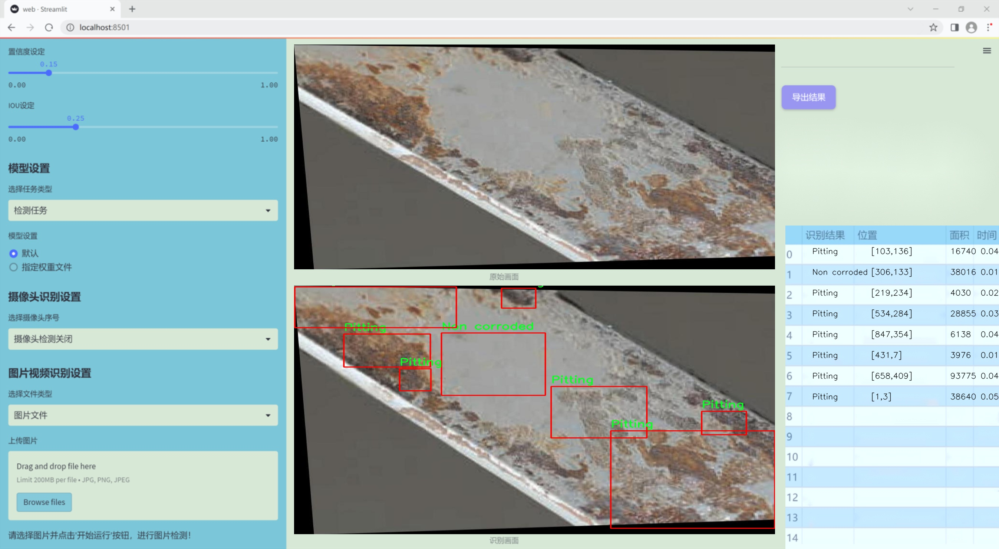
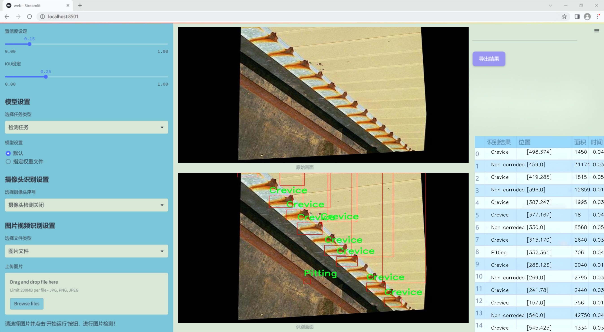
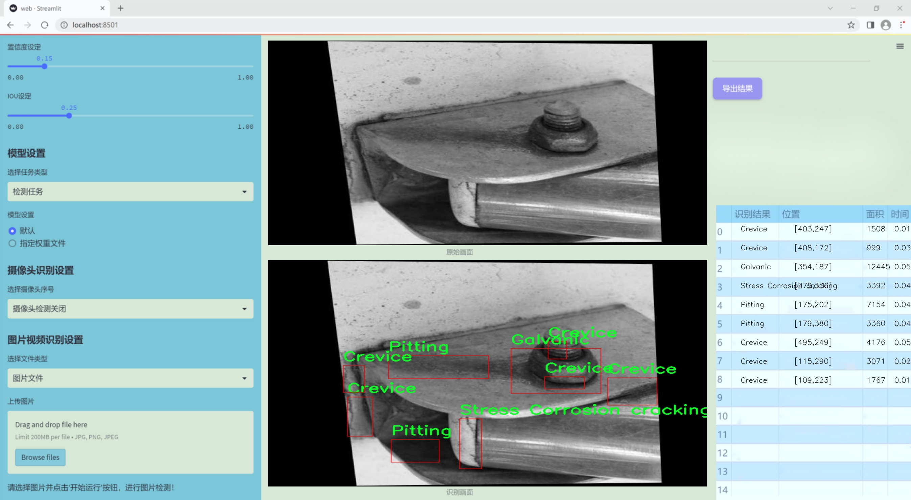
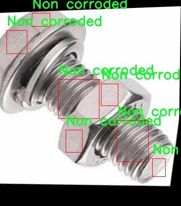
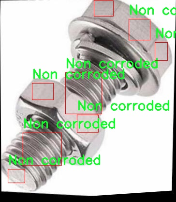
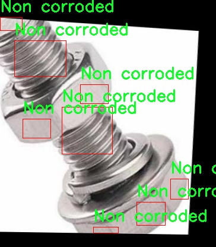
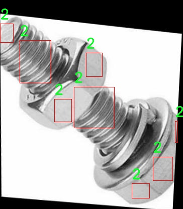
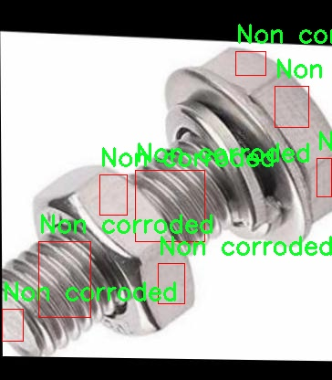

### 1.背景意义

研究背景与意义

腐蚀是材料在环境因素作用下发生的化学或电化学反应，导致材料性能下降甚至失效。随着工业化进程的加快，腐蚀问题日益严重，给各行各业带来了巨大的经济损失和安全隐患。特别是在建筑、交通运输、能源等关键领域，腐蚀不仅影响设备的使用寿命，还可能导致严重的安全事故。因此，开发高效的腐蚀检测与分类系统显得尤为重要。

近年来，计算机视觉技术的快速发展为腐蚀检测提供了新的解决方案。尤其是基于深度学习的目标检测算法，如YOLO（You Only Look Once），因其高效的实时检测能力和良好的准确性，逐渐成为腐蚀检测领域的研究热点。YOLOv11作为YOLO系列的最新版本，具备更强的特征提取能力和更快的推理速度，能够有效应对复杂环境下的腐蚀类型检测任务。

本研究旨在基于改进的YOLOv11模型，构建一个高效的腐蚀类型检测系统。该系统将针对六种腐蚀类型进行分类，包括裂缝腐蚀、镀锌腐蚀、未腐蚀、点蚀和应力腐蚀开裂等。通过使用包含2301张经过精细标注的图像数据集，我们将利用数据增强技术提升模型的泛化能力，确保其在实际应用中的鲁棒性。

通过本项目的实施，不仅可以提高腐蚀检测的准确性和效率，还能够为相关行业提供可靠的技术支持，降低因腐蚀引发的安全风险和经济损失。最终，我们希望该系统能够在实际应用中发挥重要作用，为腐蚀防治提供科学依据和技术保障。

### 2.视频效果

[2.1 视频效果](https://www.bilibili.com/video/BV1JVBvYvE7z/)

### 3.图片效果







##### [项目涉及的源码数据来源链接](https://kdocs.cn/l/cszuIiCKVNis)**

注意：本项目提供训练的数据集和训练教程,由于版本持续更新,暂不提供权重文件（best.pt）,请按照6.训练教程进行训练后实现上图演示的效果。

### 4.数据集信息

##### 4.1 本项目数据集类别数＆类别名

nc: 6
names: ['2', 'Crevice', 'Galvanic', 'Non corroded', 'Pitting', 'Stress Corrosion cracking']


该项目为【目标检测】数据集，请在【训练教程和Web端加载模型教程（第三步）】这一步的时候按照【目标检测】部分的教程来训练

##### 4.2 本项目数据集信息介绍

本项目数据集信息介绍

本项目所使用的数据集旨在支持改进YOLOv11的腐蚀类型检测系统，特别聚焦于腐蚀现象的多样性和复杂性。数据集包含六个主要类别，分别为“2”、“Crevice”、“Galvanic”、“Non corroded”、“Pitting”和“Stress Corrosion cracking”。这些类别涵盖了不同类型的腐蚀特征，反映了在实际应用中可能遇到的各种腐蚀形态。

数据集中的“Crevice”类别主要指在接触面或连接处形成的腐蚀，通常由于流体流动不畅而导致的局部环境恶化。相对而言，“Galvanic”类别则涉及到由于电化学反应引起的腐蚀，常见于不同金属接触的情境。另一方面，“Non corroded”类别则代表未受腐蚀影响的表面，为模型提供了对比数据，以便更好地识别和分类其他腐蚀类型。

“Pitting”类别则是指表面形成的小孔或凹坑，这种腐蚀形式在金属材料中非常常见，且其检测难度较大，故而对模型的训练提出了更高的要求。最后，“Stress Corrosion cracking”类别则关注由于应力和腐蚀共同作用而导致的裂纹，通常在高应力环境下更为明显，这一类别的准确识别对于结构安全至关重要。

通过对这些类别的深入分析和标注，数据集为训练改进后的YOLOv11模型提供了丰富的样本，确保模型能够在多种腐蚀情境下进行有效的检测与分类。这不仅有助于提升腐蚀检测的准确性，还能为相关领域的研究和应用提供重要的数据支持。整体而言，本项目的数据集不仅具备多样性和代表性，还在一定程度上反映了实际工业环境中腐蚀现象的复杂性，为后续的研究和开发奠定了坚实的基础。











### 5.全套项目环境部署视频教程（零基础手把手教学）

[5.1 所需软件PyCharm和Anaconda安装教程（第一步）](https://www.bilibili.com/video/BV1BoC1YCEKi/?spm_id_from=333.999.0.0&vd_source=bc9aec86d164b67a7004b996143742dc)


[5.2 安装Python虚拟环境创建和依赖库安装视频教程（第二步）](https://www.bilibili.com/video/BV1ZoC1YCEBw?spm_id_from=333.788.videopod.sections&vd_source=bc9aec86d164b67a7004b996143742dc)

### 6.改进YOLOv11训练教程和Web_UI前端加载模型教程（零基础手把手教学）

[6.1 改进YOLOv11训练教程和Web_UI前端加载模型教程（第三步）](https://www.bilibili.com/video/BV1BoC1YCEhR?spm_id_from=333.788.videopod.sections&vd_source=bc9aec86d164b67a7004b996143742dc)


按照上面的训练视频教程链接加载项目提供的数据集，运行train.py即可开始训练



     Epoch   gpu_mem       box       obj       cls    labels  img_size
     1/200     20.8G   0.01576   0.01955  0.007536        22      1280: 100%|██████████| 849/849 [14:42<00:00,  1.04s/it]
               Class     Images     Labels          P          R     mAP@.5 mAP@.5:.95: 100%|██████████| 213/213 [01:14<00:00,  2.87it/s]
                 all       3395      17314      0.994      0.957      0.0957      0.0843

     Epoch   gpu_mem       box       obj       cls    labels  img_size
     2/200     20.8G   0.01578   0.01923  0.007006        22      1280: 100%|██████████| 849/849 [14:44<00:00,  1.04s/it]
               Class     Images     Labels          P          R     mAP@.5 mAP@.5:.95: 100%|██████████| 213/213 [01:12<00:00,  2.95it/s]
                 all       3395      17314      0.996      0.956      0.0957      0.0845

     Epoch   gpu_mem       box       obj       cls    labels  img_size
     3/200     20.8G   0.01561    0.0191  0.006895        27      1280: 100%|██████████| 849/849 [10:56<00:00,  1.29it/s]
               Class     Images     Labels          P          R     mAP@.5 mAP@.5:.95: 100%|███████   | 187/213 [00:52<00:00,  4.04it/s]
                 all       3395      17314      0.996      0.957      0.0957      0.0845


###### [项目数据集下载链接](https://kdocs.cn/l/cszuIiCKVNis)

### 7.原始YOLOv11算法讲解


###### YOLOv11改进方向

与YOLOv 10相比，YOLOv 11有了巨大的改进，包括但不限于：

  * 增强的模型结构：模型具有改进的模型结构，以获取图像处理并形成预测
  * GPU优化：这是现代ML模型的反映，GPU训练ML模型在速度和准确性上都更好。
  * 速度：YOLOv 11模型现在经过增强和GPU优化以用于训练。通过优化，这些模型比它们的前版本快得多。在速度上达到了25%的延迟减少！
  * 更少的参数：更少的参数允许更快的模型，但v11的准确性不受影响
  * 更具适应性：更多支持的任务YOLOv 11支持多种类型的任务、多种类型的对象和多种类型的图像。

###### YOLOv11功能介绍

Glenn Jocher和他的团队制作了一个令人敬畏的YOLOv 11迭代，并且在图像人工智能的各个方面都提供了YOLO。YOLOv 11有多种型号，包括：

  * 对象检测-在训练时检测图像中的对象
  * 图像分割-超越对象检测，分割出图像中的对象
  * 姿态检测-当用点和线训练时绘制一个人的姿势
  * 定向检测（OBB）：类似于对象检测，但包围盒可以旋转
  * 图像分类-在训练时对图像进行分类

使用Ultralytics Library，这些模型还可以进行优化，以：

  * 跟踪-可以跟踪对象的路径
  * 易于导出-库可以以不同的格式和目的导出
  * 多场景-您可以针对不同的对象和图像训练模型

此外，Ultralytics还推出了YOLOv 11的企业模型，该模型将于10月31日发布。这将与开源的YOLOv
11模型并行，但将拥有更大的专有Ultralytics数据集。YOLOv 11是“建立在过去的成功”的其他版本的之上。

###### YOLOv11模型介绍

YOLOv 11附带了边界框模型（无后缀），实例分割（-seg），姿态估计（-pose），定向边界框（-obb）和分类（-cls）。

这些也有不同的尺寸：纳米（n），小（s），中（m），大（l），超大（x）。


YOLOv11模型

###### YOLOv11与前版本对比

与YOLOv10和YOLOv8相比，YOLOv11在Ultralytics的任何帖子中都没有直接提到。所以我会收集所有的数据来比较它们。感谢Ultralytics：

**检测：**


YOLOv11检测统计


YOLOv10检测统计

其中，Nano的mAPval在v11上为39.5，v10上为38.5；Small为47.0 vs 46.3，Medium为51.5 vs
51.1，Large为53.4 vs 53.2，Extra Large为54.7vs
54.4。现在，这可能看起来像是一种增量增加，但小小数的增加可能会对ML模型产生很大影响。总体而言，YOLOv11以0.3
mAPval的优势追平或击败YOLOv10。

现在，我们必须看看速度。在延迟方面，Nano在v11上为1.55 , v10上为1.84，Small为2.46 v2.49，Medium为4.70
v4.74，Large为6.16 v7.28，Extra Large为11.31
v10.70。延迟越低越好。YOLOv11提供了一个非常低的延迟相比，除了特大做得相当差的前身。

总的来说，Nano模型是令人振奋的，速度更快，性能相当。Extra Large在性能上有很好的提升，但它的延迟非常糟糕。

**分割：**


YOLOV11 分割统计


YOLOV9 分割统计


YOLOV8 分割数据

总体而言，YOLOv 11上的分割模型在大型和超大型模型方面比上一代YOLOv 8和YOLOv 9做得更好。

YOLOv 9 Segmentation没有提供任何关于延迟的统计数据。比较YOLOv 11延迟和YOLOv 8延迟，发现YOLOv 11比YOLOv
8快得多。YOLOv 11将大量GPU集成到他们的模型中，因此期望他们的模型甚至比CPU测试的基准更快！

姿态估计：


YOLOV11姿态估计统计


YOLOV8姿态估计统计

YOLOv 11的mAP 50 -95统计量也逐渐优于先前的YOLOv 8（除大型外）。然而，在速度方面，YOLOv
11姿势可以最大限度地减少延迟。其中一些延迟指标是版本的1/4！通过对这些模型进行GPU训练优化，我可以看到指标比显示的要好得多。

**定向边界框：**


YOLOv11 OBB统计


YOLOv8 OBB统计

OBB统计数据在mAP
50上并不是很好，只有非常小的改进，在某种程度上小于检测中的微小改进。然而，从v8到v11的速度减半，这表明YOLOv11在速度上做了很多努力。

**最后，分类：**


YOLOv 11 CLS统计


YOLOv8 CLS统计

从v8到v11，准确性也有了微小的提高。然而，速度大幅上升，CPU速度更快的型号。


### 8.200+种全套改进YOLOV11创新点原理讲解

#### 8.1 200+种全套改进YOLOV11创新点原理讲解大全

由于篇幅限制，每个创新点的具体原理讲解就不全部展开，具体见下列网址中的改进模块对应项目的技术原理博客网址【Blog】（创新点均为模块化搭建，原理适配YOLOv5~YOLOv11等各种版本）

[改进模块技术原理博客【Blog】网址链接](https://gitee.com/qunmasj/good)


#### 8.2 精选部分改进YOLOV11创新点原理讲解

###### 这里节选部分改进创新点展开原理讲解(完整的改进原理见上图和[改进模块技术原理博客链接](https://gitee.com/qunmasj/good)【如果此小节的图加载失败可以通过CSDN或者Github搜索该博客的标题访问原始博客，原始博客图片显示正常】


### HRNet V2简介
现在设计高低分辨率融合的思路主要有以下四种：


（a）对称结构。如U-Net、Hourglass等，都是先下采样再上采样，上下采样过程对称。

（b）级联金字塔。如refinenet等，高低分辨率融合时经过卷积处理。

（c）简单的baseline，用转职卷积进行上采样。

（d）扩张卷积。如deeplab等，增大感受野，减少下采样次数，可以无需跳层连接直接进行上采样。

（b）（c）都是使用复杂一些的网络进行下采样（如resnet、vgg），再用轻量级的网络进行上采样。

HRNet V1是在（b）的基础上进行改进，从头到尾保持大的分辨率表示。然而HRNet V1仅是用在姿态估计领域的，HRNet V2对它做小小的改进可以使其适用于更广的视觉任务。这一改进仅仅增加了较小的计算开销，但却提升了较大的准确度。

#### 网络结构图：


这个结构图简洁明了就不多介绍了，首先图2的输入是已经经过下采样四倍的feature map，横向的conv block指的是basicblock 或 bottleblock，不同分辨率之间的多交叉线部分是multi-resolution convolution（多分辨率组卷积）。

到此为止HRNet V2和HRNet V1是完全一致的。

区别之处在于这个基网络上加的一个head：


图3介绍的是接在图2最后的head。（a）是HRNet V1的头，很明显他只用了大分辨率的特征图。（b）（c）是HRNet V2的创新点，（b）用与语义分割，（c）用于目标检测。除此之外作者还在实验部分介绍了用于分类的head，如图4所示。


#### 多分辨率block：


一个多分辨率block由多分辨率组卷积（a）和多分辨率卷积（b）组成。（c）是一个正常卷积的展开，（b）的灵感来源于（c）。代码中（a）部分由Bottleneck和BasicBlock组成。

多分辨率卷积和正常卷积的区别：（1）多分辨率卷积中，每个通道的subset的分辨率都不一样。（2）通道之间的连接如果是降分辨率，则用的是3x3的2stride的卷积，如果是升分辨率，用的是双线性最邻近插值上采样。


### 9.系统功能展示

图9.1.系统支持检测结果表格显示

  图9.2.系统支持置信度和IOU阈值手动调节

  图9.3.系统支持自定义加载权重文件best.pt(需要你通过步骤5中训练获得)

  图9.4.系统支持摄像头实时识别

  图9.5.系统支持图片识别

  图9.6.系统支持视频识别

  图9.7.系统支持识别结果文件自动保存

  图9.8.系统支持Excel导出检测结果数据


### 10. YOLOv11核心改进源码讲解

#### 10.1 kacn_conv.py

以下是经过简化和注释的核心代码部分：

```python
import torch
import torch.nn as nn

class KACNConvNDLayer(nn.Module):
    def __init__(self, conv_class, norm_class, input_dim, output_dim, degree, kernel_size,
                 groups=1, padding=0, stride=1, dilation=1,
                 ndim: int = 2, dropout=0.0):
        super(KACNConvNDLayer, self).__init__()
        
        # 初始化参数
        self.inputdim = input_dim  # 输入维度
        self.outdim = output_dim    # 输出维度
        self.degree = degree         # 多项式的度数
        self.kernel_size = kernel_size  # 卷积核大小
        self.padding = padding       # 填充
        self.stride = stride         # 步幅
        self.dilation = dilation     # 膨胀
        self.groups = groups         # 分组卷积
        self.ndim = ndim             # 维度（1D, 2D, 3D）
        
        # 初始化 dropout
        self.dropout = None
        if dropout > 0:
            if ndim == 1:
                self.dropout = nn.Dropout1d(p=dropout)
            elif ndim == 2:
                self.dropout = nn.Dropout2d(p=dropout)
            elif ndim == 3:
                self.dropout = nn.Dropout3d(p=dropout)

        # 检查参数有效性
        if groups <= 0:
            raise ValueError('groups must be a positive integer')
        if input_dim % groups != 0:
            raise ValueError('input_dim must be divisible by groups')
        if output_dim % groups != 0:
            raise ValueError('output_dim must be divisible by groups')

        # 初始化层归一化和卷积层
        self.layer_norm = nn.ModuleList([norm_class(output_dim // groups) for _ in range(groups)])
        self.poly_conv = nn.ModuleList([conv_class((degree + 1) * input_dim // groups,
                                                   output_dim // groups,
                                                   kernel_size,
                                                   stride,
                                                   padding,
                                                   dilation,
                                                   groups=1,
                                                   bias=False) for _ in range(groups)])
        
        # 注册一个缓冲区用于多项式计算
        arange_buffer_size = (1, 1, -1,) + tuple(1 for _ in range(ndim))
        self.register_buffer("arange", torch.arange(0, degree + 1, 1).view(*arange_buffer_size))
        
        # 初始化卷积层权重
        for conv_layer in self.poly_conv:
            nn.init.normal_(conv_layer.weight, mean=0.0, std=1 / (input_dim * (degree + 1) * kernel_size ** ndim))

    def forward_kacn(self, x, group_index):
        # 前向传播过程，应用激活函数和线性变换
        x = torch.tanh(x)  # 应用tanh激活函数
        x = x.acos().unsqueeze(2)  # 计算反余弦并增加维度
        x = (x * self.arange).flatten(1, 2)  # 乘以arange并展平
        x = x.cos()  # 计算余弦
        x = self.poly_conv[group_index](x)  # 应用卷积层
        x = self.layer_norm[group_index](x)  # 应用层归一化
        if self.dropout is not None:
            x = self.dropout(x)  # 应用dropout
        return x

    def forward(self, x):
        # 前向传播，处理输入数据
        split_x = torch.split(x, self.inputdim // self.groups, dim=1)  # 按组分割输入
        output = []
        for group_ind, _x in enumerate(split_x):
            y = self.forward_kacn(_x.clone(), group_ind)  # 对每个组调用forward_kacn
            output.append(y.clone())  # 收集输出
        y = torch.cat(output, dim=1)  # 合并输出
        return y

# 下面的类是特定维度的卷积层，继承自KACNConvNDLayer
class KACNConv3DLayer(KACNConvNDLayer):
    def __init__(self, input_dim, output_dim, kernel_size, degree=3, groups=1, padding=0, stride=1, dilation=1,
                 dropout=0.0):
        super(KACNConv3DLayer, self).__init__(nn.Conv3d, nn.BatchNorm3d,
                                              input_dim, output_dim,
                                              degree, kernel_size,
                                              groups=groups, padding=padding, stride=stride, dilation=dilation,
                                              ndim=3, dropout=dropout)

class KACNConv2DLayer(KACNConvNDLayer):
    def __init__(self, input_dim, output_dim, kernel_size, degree=3, groups=1, padding=0, stride=1, dilation=1,
                 dropout=0.0):
        super(KACNConv2DLayer, self).__init__(nn.Conv2d, nn.BatchNorm2d,
                                              input_dim, output_dim,
                                              degree, kernel_size,
                                              groups=groups, padding=padding, stride=stride, dilation=dilation,
                                              ndim=2, dropout=dropout)

class KACNConv1DLayer(KACNConvNDLayer):
    def __init__(self, input_dim, output_dim, kernel_size, degree=3, groups=1, padding=0, stride=1, dilation=1,
                 dropout=0.0):
        super(KACNConv1DLayer, self).__init__(nn.Conv1d, nn.BatchNorm1d,
                                              input_dim, output_dim,
                                              degree, kernel_size,
                                              groups=groups, padding=padding, stride=stride, dilation=dilation,
                                              ndim=1, dropout=dropout)
```

### 代码说明：
1. **KACNConvNDLayer**: 这是一个通用的卷积层类，支持多维卷积（1D、2D、3D）。它初始化卷积层、归一化层，并在前向传播中实现了多项式卷积的计算。
2. **forward_kacn**: 该方法实现了多项式卷积的前向传播逻辑，包括激活函数、线性变换和归一化。
3. **forward**: 该方法将输入按组分割，并对每个组调用`forward_kacn`进行处理，最后合并输出。
4. **KACNConv1DLayer、KACNConv2DLayer、KACNConv3DLayer**: 这些类分别为1D、2D和3D卷积层的具体实现，继承自`KACNConvNDLayer`，并指定相应的卷积和归一化类。

这个文件定义了一个名为 `kacn_conv.py` 的模块，主要实现了一个自定义的卷积层，称为 KACN（Kaiming Activation Cosine Normalization）卷积层。这个模块是基于 PyTorch 框架构建的，包含了多个类，分别用于处理不同维度的卷积操作（1D、2D 和 3D）。

首先，`KACNConvNDLayer` 是一个通用的卷积层类，它继承自 `nn.Module`。在初始化方法中，接受了多个参数，包括卷积类型、归一化类型、输入和输出维度、卷积核大小、分组数、填充、步幅、扩张、维度数量和 dropout 比例。根据传入的参数，类内部会进行一些基本的验证，例如确保分组数是正整数，并且输入和输出维度能够被分组数整除。

在这个类中，还定义了一个 `ModuleList` 来存储多个归一化层和卷积层。归一化层使用传入的 `norm_class`，而卷积层则使用传入的 `conv_class`，并且卷积层的数量与分组数相同。卷积层的权重会使用 Kaiming 正态分布进行初始化，以便于更好的训练起始。

`forward_kacn` 方法是该类的核心，负责实现 KACN 的前向传播逻辑。首先对输入进行激活，然后通过一系列的数学变换（包括反余弦、乘以一个缓冲区和余弦操作）进行处理，最后通过相应的卷积层和归一化层得到输出。如果设置了 dropout，则在输出前应用 dropout。

`forward` 方法则负责将输入按照分组进行切分，并对每个分组调用 `forward_kacn` 方法进行处理，最后将所有分组的输出拼接在一起返回。

接下来，`KACNConv3DLayer`、`KACNConv2DLayer` 和 `KACNConv1DLayer` 是三个具体的卷积层实现，分别对应三维、二维和一维卷积。它们都继承自 `KACNConvNDLayer`，并在初始化时传入相应的卷积和归一化类（如 `nn.Conv3d` 和 `nn.BatchNorm3d` 等），以及其他参数。

总的来说，这个模块提供了一种灵活的方式来创建不同维度的 KACN 卷积层，结合了自定义的激活函数和归一化方法，适用于深度学习中的各种应用场景。

#### 10.2 cfpt.py

以下是代码中最核心的部分，并附上详细的中文注释：

```python
import torch
import torch.nn as nn
import torch.nn.functional as F
from timm.layers import to_2tuple, trunc_normal_

class CrossLayerPosEmbedding3D(nn.Module):
    def __init__(self, num_heads=4, window_size=(5, 3, 1), spatial=True):
        super(CrossLayerPosEmbedding3D, self).__init__()
        self.spatial = spatial  # 是否使用空间位置嵌入
        self.num_heads = num_heads  # 注意力头的数量
        self.layer_num = len(window_size)  # 层数
        # 初始化相对位置偏置表
        self.relative_position_bias_table = nn.Parameter(
            torch.zeros((2 * window_size[0] - 1) * (2 * window_size[0] - 1), num_heads)
        )
        # 计算相对位置索引
        self.register_buffer("relative_position_index", self._calculate_relative_position_index(window_size))
        trunc_normal_(self.relative_position_bias_table, std=.02)  # 初始化相对位置偏置

        # 初始化绝对位置偏置
        self.absolute_position_bias = nn.Parameter(torch.zeros(len(window_size), num_heads, 1, 1, 1))
        trunc_normal_(self.absolute_position_bias, std=.02)  # 初始化绝对位置偏置

    def _calculate_relative_position_index(self, window_size):
        # 计算相对位置索引的逻辑
        coords_h = [torch.arange(ws) - ws // 2 for ws in window_size]
        coords_w = [torch.arange(ws) - ws // 2 for ws in window_size]
        coords = [torch.stack(torch.meshgrid([coord_h, coord_w])) for coord_h, coord_w in zip(coords_h, coords_w)]
        coords_flatten = torch.cat([torch.flatten(coord, 1) for coord in coords], dim=-1)
        relative_coords = coords_flatten[:, :, None] - coords_flatten[:, None, :]
        relative_coords = relative_coords.permute(1, 2, 0).contiguous()
        relative_coords[:, :, 0] += window_size[0] - 1
        relative_coords[:, :, 1] += window_size[0] - 1
        relative_coords[:, :, 0] *= 2 * window_size[0] - 1
        return relative_coords.sum(-1)

    def forward(self):
        # 计算位置嵌入
        pos_indicies = self.relative_position_index.view(-1)
        pos_indicies_floor = torch.floor(pos_indicies).long()
        pos_indicies_ceil = torch.ceil(pos_indicies).long()
        value_floor = self.relative_position_bias_table[pos_indicies_floor]
        value_ceil = self.relative_position_bias_table[pos_indicies_ceil]
        weights_ceil = pos_indicies - pos_indicies_floor.float()
        weights_floor = 1.0 - weights_ceil

        pos_embed = weights_floor.unsqueeze(-1) * value_floor + weights_ceil.unsqueeze(-1) * value_ceil
        pos_embed = pos_embed.reshape(1, 1, self.num_token, -1, self.num_heads).permute(0, 4, 1, 2, 3)

        return pos_embed

class CrossLayerSpatialAttention(nn.Module):
    def __init__(self, in_dim, layer_num=3, beta=1, num_heads=4, mlp_ratio=2, reduction=4):
        super(CrossLayerSpatialAttention, self).__init__()
        self.num_heads = num_heads  # 注意力头的数量
        self.reduction = reduction  # 降维比例
        self.window_sizes = [(2 ** i + beta) if i != 0 else (2 ** i + beta - 1) for i in range(layer_num)][::-1]
        self.token_num_per_layer = [i ** 2 for i in self.window_sizes]  # 每层的token数量
        self.token_num = sum(self.token_num_per_layer)  # 总token数量

        # 初始化卷积位置编码、归一化层、QKV卷积层和MLP层
        self.cpe = nn.ModuleList([ConvPosEnc(dim=in_dim, k=3) for _ in range(layer_num)])
        self.norm1 = nn.ModuleList(LayerNormProxy(in_dim) for _ in range(layer_num))
        self.norm2 = nn.ModuleList(nn.LayerNorm(in_dim) for _ in range(layer_num))
        self.qkv = nn.ModuleList(nn.Conv2d(in_dim, in_dim * 3, kernel_size=1) for _ in range(layer_num))
        self.mlp = nn.ModuleList(Mlp(in_features=in_dim, hidden_features=int(in_dim * mlp_ratio)) for _ in range(layer_num))
        self.softmax = nn.Softmax(dim=-1)  # Softmax层
        self.pos_embed = CrossLayerPosEmbedding3D(num_heads=num_heads, window_size=self.window_sizes, spatial=True)  # 位置嵌入

    def forward(self, x_list):
        # 前向传播
        q_list, k_list, v_list = [], [], []
        for i, x in enumerate(x_list):
            x = self.cpe[i](x)  # 应用卷积位置编码
            qkv = self.qkv[i](x)  # 计算QKV
            q, k, v = qkv.chunk(3, dim=1)  # 分割QKV
            q_list.append(q)
            k_list.append(k)
            v_list.append(v)

        # 计算注意力
        q_stack = torch.cat(q_list, dim=1)
        k_stack = torch.cat(k_list, dim=1)
        v_stack = torch.cat(v_list, dim=1)
        attn = F.normalize(q_stack, dim=-1) @ F.normalize(k_stack, dim=-1).transpose(-1, -2)  # 计算注意力
        attn = attn + self.pos_embed()  # 加上位置嵌入
        attn = self.softmax(attn)  # 应用Softmax

        out = attn @ v_stack  # 计算输出
        for i in range(len(x_list)):
            out = self.norm1[i](out) + x_list[i]  # 残差连接
            out = self.cpe[i](out)  # 应用卷积位置编码
            out = out + self.mlp[i](self.norm2[i](out))  # 应用MLP和残差连接

        return out  # 返回输出
```

### 代码核心部分说明：
1. **CrossLayerPosEmbedding3D**: 这个类用于计算3D的交叉层位置嵌入，包含相对位置和绝对位置的偏置。它的初始化方法计算相对位置索引，并使用正态分布初始化位置偏置。

2. **CrossLayerSpatialAttention**: 这个类实现了跨层空间注意力机制。它包含多个层，每层都有卷积位置编码、归一化层、QKV卷积层和MLP层。在前向传播中，它计算注意力权重并应用于输入，最终返回经过处理的输出。

这些部分是实现跨层注意力机制的核心，负责处理输入数据并计算注意力权重。

这个程序文件 `cfpt.py` 实现了一个深度学习模型的核心组件，主要用于图像处理任务中的跨层注意力机制。文件中定义了多个类和函数，主要包括层归一化、位置嵌入、卷积位置编码、深度卷积、MLP（多层感知机）等。以下是对文件中主要部分的详细讲解。

首先，`LayerNormProxy` 类是一个简单的层归一化模块，使用 `nn.LayerNorm` 对输入进行归一化处理。在前向传播中，它将输入的维度进行重排，以适应 `LayerNorm` 的要求。

接下来，`CrossLayerPosEmbedding3D` 类用于生成跨层的位置信息嵌入。该类根据输入的窗口大小和头数，计算相对位置偏置，并生成绝对位置偏置。它的前向传播方法计算位置嵌入并返回。

`ConvPosEnc` 类实现了卷积位置编码，通过卷积操作增强输入特征，并可选择性地添加激活函数。`DWConv` 类则实现了深度卷积，适用于处理具有多个通道的输入。

`Mlp` 类是一个简单的多层感知机，包含两个线性层和一个激活函数。它的前向传播方法依次通过线性层和激活函数处理输入。

文件中还定义了一些辅助函数，如 `overlaped_window_partition` 和 `overlaped_window_reverse`，用于处理重叠窗口的分割和重组。这些函数对于实现跨层注意力机制至关重要。

`CrossLayerSpatialAttention` 类实现了跨层空间注意力机制。它通过多个层来处理输入特征，并计算注意力权重。每一层都包含卷积位置编码、层归一化、查询-键-值（QKV）计算、注意力计算和MLP处理。该类的前向传播方法接受多个输入特征图，并通过注意力机制生成输出。

`CrossLayerChannelAttention` 类实现了跨层通道注意力机制，结构与 `CrossLayerSpatialAttention` 类似，但处理方式有所不同。它使用通道的重排和反卷积来处理输入特征，并在每一层中应用注意力机制。

总体而言，这个文件实现了一个复杂的深度学习模块，结合了空间和通道注意力机制，适用于图像处理任务。通过使用位置嵌入和多层感知机，该模型能够有效地捕捉图像中的重要特征，并进行更精确的特征表示。

#### 10.3 rmt.py

以下是经过简化和注释的核心代码部分，保留了模型的主要结构和功能。

```python
import torch
import torch.nn as nn
import torch.nn.functional as F

class DWConv2d(nn.Module):
    """ 深度可分离卷积层 """
    def __init__(self, dim, kernel_size, stride, padding):
        super().__init__()
        # 使用分组卷积实现深度可分离卷积
        self.conv = nn.Conv2d(dim, dim, kernel_size, stride, padding, groups=dim)

    def forward(self, x: torch.Tensor):
        """ 前向传播
        x: 输入张量，形状为 (b, h, w, c)
        """
        x = x.permute(0, 3, 1, 2)  # 转换为 (b, c, h, w)
        x = self.conv(x)  # 卷积操作
        x = x.permute(0, 2, 3, 1)  # 转换回 (b, h, w, c)
        return x

class FeedForwardNetwork(nn.Module):
    """ 前馈神经网络 """
    def __init__(self, embed_dim, ffn_dim, activation_fn=F.gelu, dropout=0.0):
        super().__init__()
        self.fc1 = nn.Linear(embed_dim, ffn_dim)  # 第一层线性变换
        self.fc2 = nn.Linear(ffn_dim, embed_dim)  # 第二层线性变换
        self.dropout = nn.Dropout(dropout)  # Dropout层
        self.activation_fn = activation_fn  # 激活函数

    def forward(self, x: torch.Tensor):
        """ 前向传播
        x: 输入张量，形状为 (b, h, w, c)
        """
        x = self.fc1(x)  # 线性变换
        x = self.activation_fn(x)  # 激活函数
        x = self.dropout(x)  # Dropout
        x = self.fc2(x)  # 线性变换
        return x

class RetBlock(nn.Module):
    """ 保留块，用于模型的基本构建 """
    def __init__(self, embed_dim, num_heads, ffn_dim):
        super().__init__()
        self.ffn = FeedForwardNetwork(embed_dim, ffn_dim)  # 前馈网络
        self.pos = DWConv2d(embed_dim, 3, 1, 1)  # 位置卷积

    def forward(self, x: torch.Tensor):
        """ 前向传播
        x: 输入张量，形状为 (b, h, w, c)
        """
        x = x + self.pos(x)  # 添加位置编码
        x = self.ffn(x)  # 前馈网络
        return x

class VisRetNet(nn.Module):
    """ 可视化保留网络 """
    def __init__(self, in_chans=3, num_classes=1000, embed_dims=[96, 192, 384, 768], depths=[2, 2, 6, 2], num_heads=[3, 6, 12, 24]):
        super().__init__()
        self.patch_embed = nn.Conv2d(in_chans, embed_dims[0], kernel_size=4, stride=4)  # 图像到补丁的嵌入
        self.layers = nn.ModuleList()  # 存储网络层

        # 构建每一层
        for i in range(len(depths)):
            layer = nn.ModuleList([RetBlock(embed_dims[i], num_heads[i], embed_dims[i] * 4) for _ in range(depths[i])])
            self.layers.append(layer)

    def forward(self, x):
        """ 前向传播
        x: 输入张量，形状为 (b, c, h, w)
        """
        x = self.patch_embed(x)  # 嵌入
        for layer in self.layers:
            for blk in layer:
                x = blk(x)  # 通过每个块
        return x

def RMT_T():
    """ 创建 RMT_T 模型 """
    model = VisRetNet(
        embed_dims=[64, 128, 256, 512],
        depths=[2, 2, 8, 2],
        num_heads=[4, 4, 8, 16]
    )
    return model

if __name__ == '__main__':
    model = RMT_T()  # 实例化模型
    inputs = torch.randn((1, 3, 640, 640))  # 随机输入
    res = model(inputs)  # 前向传播
    print(res.size())  # 输出结果的形状
```

### 代码说明：
1. **DWConv2d**: 实现了深度可分离卷积，用于减少模型参数和计算量。
2. **FeedForwardNetwork**: 实现了前馈神经网络，包括两个线性层和一个激活函数。
3. **RetBlock**: 由前馈网络和位置卷积组成的基本块，用于模型的构建。
4. **VisRetNet**: 主模型类，负责构建整个网络结构，包括补丁嵌入和多个保留块。
5. **RMT_T**: 创建一个特定配置的模型实例。

这个简化版本保留了模型的核心结构，并提供了必要的注释以帮助理解每个部分的功能。

这个程序文件 `rmt.py` 实现了一个视觉变换器（Vision Transformer）模型，名为 `VisRetNet`，并提供了多种不同规模的模型构建函数（如 `RMT_T`, `RMT_S`, `RMT_B`, `RMT_L`）。以下是对文件中各个部分的详细说明。

首先，文件导入了必要的库，包括 PyTorch 和一些用于构建模型的模块。模型的核心组件包括各种自定义的神经网络层，如深度卷积层、相对位置编码、注意力机制等。

文件中定义了多个类，每个类代表模型的一个组成部分：

1. **DWConv2d**：实现了深度可分离卷积，主要用于处理输入特征图的通道。

2. **RelPos2d**：用于生成二维相对位置编码，帮助模型捕捉输入特征之间的空间关系。

3. **MaSAd 和 MaSA**：实现了多头自注意力机制，分别用于处理不同的注意力计算方式。`MaSAd` 适用于分块处理，而 `MaSA` 则用于整体处理。

4. **FeedForwardNetwork**：实现了前馈神经网络，包含两个线性层和激活函数，用于对特征进行非线性变换。

5. **RetBlock**：一个残差块，结合了注意力机制和前馈网络，并支持层归一化和可选的层缩放。

6. **PatchMerging**：用于将输入特征图进行下采样，合并特征块。

7. **BasicLayer**：构建了一个基本的层，包含多个残差块，并支持相对位置编码。

8. **LayerNorm2d**：实现了二维层归一化，适用于图像数据。

9. **PatchEmbed**：将输入图像分割成小块并进行嵌入，生成适合后续处理的特征表示。

10. **VisRetNet**：主模型类，整合了所有的层和模块，负责将输入图像经过多个层处理后输出特征。

在 `VisRetNet` 的构造函数中，定义了多个参数，包括输入通道数、输出类别数、嵌入维度、层数、注意力头数等。模型通过 `PatchEmbed` 将输入图像转换为特征块，然后依次通过定义的层进行处理。

最后，文件提供了几个函数（`RMT_T`, `RMT_S`, `RMT_B`, `RMT_L`），用于创建不同规模的模型实例。每个函数设置了不同的嵌入维度、层数和注意力头数，以适应不同的任务需求。

在 `__main__` 部分，创建了一个 `RMT_T` 模型实例，并对随机生成的输入进行前向传播，输出特征的尺寸。这部分代码可以用于测试模型的构建和运行是否正常。

整体而言，这个文件实现了一个灵活且可扩展的视觉变换器模型，适用于各种计算机视觉任务。

#### 10.4 test_selective_scan_speed.py

以下是经过简化并添加详细中文注释的核心代码部分：

```python
import torch
import torch.nn.functional as F

def build_selective_scan_fn(selective_scan_cuda: object = None, mode="mamba_ssm"):
    """
    构建选择性扫描函数的工厂函数。
    
    参数:
    selective_scan_cuda: CUDA实现的选择性扫描函数
    mode: 模式选择，决定选择性扫描的具体实现
    """
    
    class SelectiveScanFn(torch.autograd.Function):
        @staticmethod
        def forward(ctx, u, delta, A, B, C, D=None, z=None, delta_bias=None, delta_softplus=False, return_last_state=False):
            """
            前向传播函数，执行选择性扫描的计算。
            
            参数:
            ctx: 上下文对象，用于保存状态
            u: 输入张量
            delta: 增量张量
            A, B, C: 相关参数
            D: 可选的额外参数
            z: 可选的状态张量
            delta_bias: 可选的增量偏置
            delta_softplus: 是否使用softplus激活
            return_last_state: 是否返回最后状态
            
            返回:
            计算结果或计算结果和最后状态的元组
            """
            # 确保输入张量是连续的
            if u.stride(-1) != 1:
                u = u.contiguous()
            if delta.stride(-1) != 1:
                delta = delta.contiguous()
            if D is not None:
                D = D.contiguous()
            if B.stride(-1) != 1:
                B = B.contiguous()
            if C.stride(-1) != 1:
                C = C.contiguous()
            if z is not None and z.stride(-1) != 1:
                z = z.contiguous()

            # 选择性扫描的具体实现
            if mode == "mamba_ssm":
                out, x, *rest = selective_scan_cuda.fwd(u, delta, A, B, C, D, z, delta_bias, delta_softplus)
            else:
                raise NotImplementedError("未实现的模式")

            # 保存状态以便反向传播
            ctx.save_for_backward(u, delta, A, B, C, D, delta_bias, x)
            last_state = x[:, :, -1, 1::2]  # 获取最后状态
            return out if not return_last_state else (out, last_state)

        @staticmethod
        def backward(ctx, dout):
            """
            反向传播函数，计算梯度。
            
            参数:
            ctx: 上下文对象，包含前向传播时保存的状态
            dout: 上游梯度
            
            返回:
            输入张量的梯度
            """
            u, delta, A, B, C, D, delta_bias, x = ctx.saved_tensors
            
            # 调用CUDA实现的反向传播
            du, ddelta, dA, dB, dC, dD, ddelta_bias, *rest = selective_scan_cuda.bwd(
                u, delta, A, B, C, D, delta_bias, dout, x, None, False
            )
            
            return (du, ddelta, dA, dB, dC, dD, ddelta_bias, None)

    def selective_scan_fn(u, delta, A, B, C, D=None, z=None, delta_bias=None, delta_softplus=False, return_last_state=False):
        """
        封装选择性扫描函数的调用。
        """
        return SelectiveScanFn.apply(u, delta, A, B, C, D, z, delta_bias, delta_softplus, return_last_state)

    return selective_scan_fn

# 示例使用
# selective_scan_fn = build_selective_scan_fn(selective_scan_cuda, mode="mamba_ssm")
```

### 代码说明：
1. **build_selective_scan_fn**: 这是一个工厂函数，用于创建选择性扫描的函数。它接受一个CUDA实现和模式参数，并返回一个可调用的选择性扫描函数。

2. **SelectiveScanFn**: 这是一个自定义的PyTorch自动求导函数，包含前向和反向传播的实现。
   - **forward**: 计算选择性扫描的前向传播。它会检查输入张量的连续性，调用CUDA实现进行计算，并保存必要的张量以供反向传播使用。
   - **backward**: 计算反向传播的梯度，调用CUDA实现的反向传播函数，并返回输入张量的梯度。

3. **selective_scan_fn**: 封装了对`SelectiveScanFn`的调用，使得用户可以直接使用这个函数进行选择性扫描的计算。

以上代码保留了核心功能，并添加了详细的中文注释以帮助理解。

这个程序文件 `test_selective_scan_speed.py` 主要用于实现和测试选择性扫描（Selective Scan）算法的速度和性能。程序中使用了 PyTorch 库来处理张量运算，并利用 CUDA 加速来提高计算效率。以下是对文件中各个部分的详细说明。

首先，程序导入了必要的库，包括 `torch`、`torch.nn.functional`、`pytest`、`time` 等，此外还使用了 `einops` 库来进行张量的重排和重复操作。接着，定义了一个函数 `build_selective_scan_fn`，该函数用于构建选择性扫描的前向和反向传播函数。函数内部定义了一个名为 `SelectiveScanFn` 的类，继承自 `torch.autograd.Function`，用于实现自定义的前向和反向传播逻辑。

在 `SelectiveScanFn` 类中，`forward` 方法负责处理前向传播。它首先确保输入张量的连续性，然后根据输入的维度和形状进行必要的调整。接着，调用 CUDA 实现的选择性扫描函数 `selective_scan_cuda.fwd`，并根据不同的模式（如 `mamba_ssm`、`sscore` 等）处理输入数据。最终，返回计算结果和最后的状态（如果需要的话）。

`backward` 方法则负责反向传播的计算，使用保存的张量进行梯度计算，并根据不同的模式调用相应的 CUDA 后向函数。它还处理了数据类型的转换，以确保梯度的正确性。

接下来，定义了几个选择性扫描的参考实现函数，如 `selective_scan_ref` 和 `selective_scan_easy`，这些函数提供了选择性扫描的基本逻辑，主要用于与 CUDA 实现进行性能比较。

在文件的最后部分，定义了 `test_speed` 函数，用于测试不同选择性扫描实现的速度。该函数设置了一些参数，包括数据类型、序列长度、批量大小等，并生成随机输入数据。然后，它通过多次调用不同的选择性扫描实现来测量其执行时间，并打印出每个实现的前向和反向传播的耗时。

总体来说，这个程序文件实现了选择性扫描算法的多种版本，并通过性能测试来评估不同实现的效率，适合用于深度学习模型中的序列数据处理。

### 11.完整训练+Web前端界面+200+种全套创新点源码、数据集获取


# [下载链接：https://mbd.pub/o/bread/Z5iZmpdt](https://mbd.pub/o/bread/Z5iZmpdt)